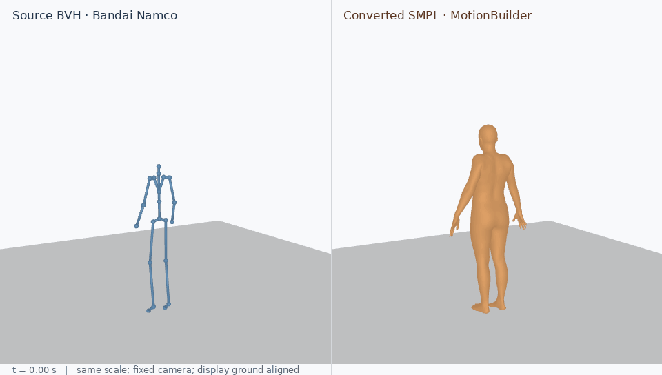

# FineMotion-Style

FineMotion (released as FineMotion-Style) is a benchmark for fine-grained motion style transfer and editing introduced in our SIGGRAPH Asia 2026 paper, *Learning Kinematic Frequency-Aware Disentanglement for Motion Style Transfer and Editing*.

The benchmark integrates CG motion data from multiple sources, focusing on preserving motion content while transferring fine-grained style characteristics. It covers four style categories: Impact, Strike, Balance, and Shake, with an emphasis on frequency-sensitive and temporally localized motion characteristics.

[Project page](https://www.dr-lab.org/projects/kinematic-frequency-motion/) · [Method code](https://github.com/dongran/kinematic-frequency-motion) · [2025 BVH processing reference](https://github.com/dongran/tempo-changing-music2motion)

## First release: one conversion example

This release provides **one Bandai Namco example**, conversion scripts, and HumanML3D-style text preparation. The full dataset and source-separated text packages are being prepared separately. Bulk downloads will be linked here through Google Drive and OneDrive when available.



**Right-hand wave.** Left: original Bandai BVH skeleton. Right: its MotionBuilder-retargeted motion rendered with a neutral SMPL body. Both use a fixed camera and real motion data. Different source/target body proportions are retained; fixed display-only floor offsets are recorded in the [render manifest](assets/bandai_wave/render_manifest.json). [MP4](assets/bandai_wave/bandai_bvh_smpl.mp4) · [Still image](assets/bandai_wave/bandai_bvh_smpl.png)

The example was selected after reviewing five simple Bandai motions. Standing and waving makes the retargeting easy to inspect, without requiring a detailed finger-pose model. The source file is `dataset-2_wave-right-hand_normal_001.bvh` from [Bandai-Namco-Research-Motiondataset-2](https://github.com/BandaiNamcoResearchInc/Bandai-Namco-Research-Motiondataset).

## What is included

- Original BVH, a Bandai-skeleton T-pose, and the prepared MotionBuilder input.
- Archived SMPL24 motion parameters at the example's 120Hz conversion rate, plus a 30Hz resampled copy: `poses(T,24,3)` in axis-angle radians and `trans(T,3)` in meters.
- A matching 20Hz HumanML263 feature file and a reviewed caption with lemma/POS tags.
- Source-specific HIK mapping, conversion entry points, a text formatter, and a genuine BVH/SMPL renderer.
- File hashes, conversion settings, validation records, and source/license notices.

SMPL model weights and the characterized target FBX/template are obtained separately under their own terms. Other-source motion data is not included in this example release.

## BVH to SMPL

The workflow follows our [JoruriPuppet / SIGGRAPH Asia 2025 processing code](https://github.com/dongran/tempo-changing-music2motion), with a Bandai-specific T-pose and character mapping:

1. **Prepare the source BVH** — [prepare_bandai.py](scripts/bandai/prepare_bandai.py)

   Original BVH + Bandai calibration T-pose → prepared BVH. One calibration frame is added: **187 → 188 frames at 30Hz**.

2. **Retarget in MotionBuilder** — [BVHtoSmpl_Bandai.py](scripts/bandai/BVHtoSmpl_Bandai.py)

   Characterize the source → connect it to the SMPL target → bake and export the target skeleton. The verified export has **749 frames at 120Hz**.

3. **Convert to SMPL24 parameters** — [finalize_bandai.py](scripts/bandai/finalize_bandai.py)

   Standardize the exported BVH → convert rotations to axis-angle and translations from centimeters to meters. Removing the first export frame gives **748 frames at 120Hz**.

See the [conversion walkthrough](docs/BVH_TO_SMPL.md) for commands and the exact frame history. The bundled HumanML263 feature is an archived downstream result; regenerating it requires the method project's motion-processing dependencies and a separately obtained SMPL model.

**Choose the sampling rate for your task.** Our training uses **20Hz HumanML263 features**. Other pipelines can use a different rate, including a higher rate, with corresponding feature-processing and model settings. The optional [30Hz example](docs/BVH_TO_SMPL.md#optional-reproduce-the-archived-30hz-variant) shows how the bundled resampled copy was made; its extra frame removal belongs to this example's calibration history.

## Text that a HumanML-style loader can read

Each motion ID has a corresponding text file:

```text
caption#lemma/POS lemma/POS ...#start_time#end_time
```

The caption describes the motion. Lemmatization gives dictionary forms; POS tags describe grammatical roles. `0#0` means the whole clip. These fields follow the [HumanML3D text layout](https://github.com/EricGuo5513/HumanML3D/blob/main/text_process.py).

Our historical annotation pipeline combined source-label descriptions and VideoLLaMA3 video descriptions, then used spaCy to produce lemma/POS fields. This release includes one short, visually reviewed wave caption. The formatter preserves the original sentence and existing tokens by default, and provides both the actual FineMotion rule and a HumanML reference rule.

```bash
python -m pip install numpy
python scripts/verify_bandai_example.py
python scripts/prepare_training_texts.py --input-dir examples/bandai_wave/training/texts --validate-only
```

To format your own captions, install `scripts/requirements-text.txt` and follow the [text preparation guide](docs/TEXT_FORMAT.md). The guide also explains multiple captions, time segments, token truncation, and how the current model code uses the fields.

## Sources and licenses

Code and documentation are MIT licensed. The Bandai source/adapted motion example and its previews are **CC BY-NC 4.0**. The example caption is distributed with the same noncommercial annotation terms. Keep the original attribution and modification notices. See [NOTICE.md](NOTICE.md) and the source-specific files in `licenses/`; the software license does not relicense motion data or model assets.

## Citation

If you use FineMotion-Style in your research, please cite our paper:

```bibtex
@inproceedings{dong2026kinematic,
  title={Learning Kinematic Frequency-Aware Disentanglement for Motion Style Transfer and Editing},
  author={Dong, Ran and Xie, Haoran and Yang, Xi},
  booktitle={SIGGRAPH Asia 2026 Conference Papers},
  year={2026},
  note={to appear}
}
```
